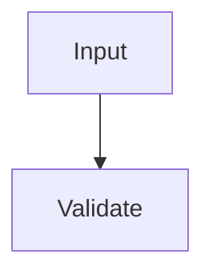

# 001-valid-feature

## Overview

Repository validator fixture.

## Requirements

- R1. The system validates repository contracts.
- R2. The system preserves deterministic results.

## Behavior & Flows



## Data & Interfaces

See [implemented context](../002-implemented-context/spec.md).

`[inline code is not a link](missing-inline.md)`

```text
[fenced example is not a link](missing-fence.md)
```

## Acceptance Criteria

- AC1 (R1–R2): Validation returns deterministic evidence.

## Decisions & History

- 2026-08-01 [DECISION] baseline decision.
