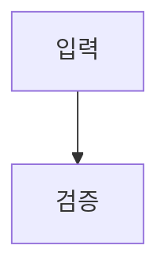

# 구조화 스펙 예제

## Overview

의존성 없는 parser의 정상 입력이다. `[NEEDS CLARIFICATION]`은 token family를 설명하는 literal이며 canonical unresolved marker가 아니다.

## Requirements

- R1. 시스템은 구조화된 필드를 보존해야 한다.
- R2. REMOVED — 이전 요구사항은 더 이상 필요하지 않다.

## Behavior & Flows

## Data & Interfaces

입력은 UTF-8 Markdown이다.

## Acceptance Criteria

- AC1 (R1–R2): parser가 요구사항 참조를 펼쳐서 보존한다.

## Decisions & History

- 2026-08-01: fixture를 추가했다.
