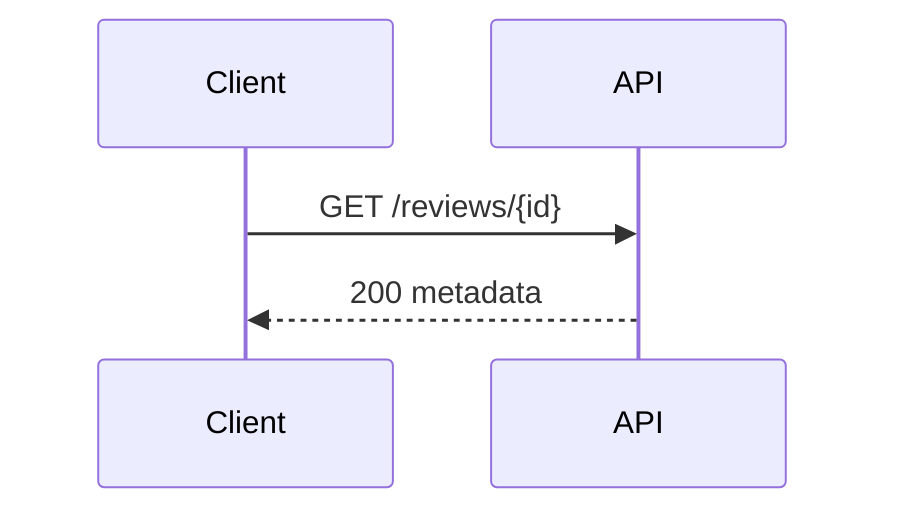

# 유연한 API 스펙

## Problem

API 계약은 endpoint와 예외를 중심으로 읽혀야 한다.

## Endpoints

| Method | Path | Result |
|---|---|---|
| `GET` | `/reviews/{id}` | review metadata |



## Requirements

- R1. API 스펙은 endpoint와 응답 계약을 원문 순서로 보존해야 한다.

## Examples

```json
{"id":"review-1"}
```

## Acceptance Criteria

- AC1 (R1): flexible section을 읽으면 endpoint Mermaid와 요구사항이 모두 보존된다.

## Decisions & History

- 2026-08-04 [DECISION] API subtype fixture를 flexible section 예제로 사용한다.
