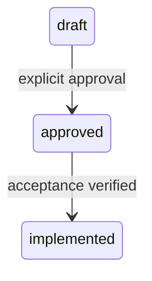

# 유연한 Workflow 스펙

## Actors

작성자와 검토자가 문서 상태를 전환한다.

## Requirements

- R1. Workflow 스펙은 actor와 상태 전이를 원문 순서로 보존해야 한다.

## State Transitions

## Acceptance Criteria

- AC1 (R1): workflow source를 읽으면 actor 설명과 상태 Mermaid를 모두 보존한다.

## Decisions & History

- 2026-08-04 [DECISION] workflow subtype fixture를 추가했다.

## Operational Notes

HTML 생성 여부는 이 source 구조와 무관하다.
