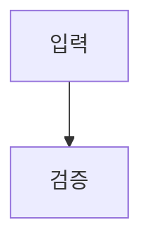

# 구조화 스펙 예제

## Overview

격리된 parser fixture다.

## Requirements

- R1. 시스템은 입력을 검증해야 한다.
- R2. 시스템은 결과를 보존해야 한다.

## Behavior & Flows

## Data & Interfaces

입력은 UTF-8 Markdown이다.

## Acceptance Criteria

- AC1 (R1): 첫 번째 승인 기준이다.
- AC3 (R2): 세 번째 승인 기준이다.

## Decisions & History

- 2026-08-01: fixture를 추가했다.
